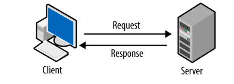

There are two codes in this repository, one representing the server and another for the client.

## Quick usage


It is required to have installed Flask. 

First, Download the project.

```
git clone https://github.com/estevanmendes/Flask_Simple_Application.git

cd Flask_Simple_Application
```

Secondly, let's run our app using Flask. 
It is set to be run in the http://localhost:5000/

```
flask --app server run --debug

```

Now, to try out the API generated with flask with  a  simulated client by the created code, let's run the code client.py

```
python client.py

```


Or run everything at once. However, recall that one must run the client code in another tab, since the app will be running on the one in which the "flask --app server run --debug" was submitted. 


```

git clone https://github.com/estevanmendes/Flask_Simple_Application.

cd Flask_Simple_Application

flask --app server run --debug

```


```
python client.py

```

### Client

The client representation was built using [unittest library](https://docs.python.org/3/library/unittest.html). 
Please pay attention to the need of changing the URL of the api

It contains many tests for all the methods of the API. 


### Server

The server uses a package called [Files](Files.py) from another Python file. 

It builds up the web app using the package file that will manage the creation, remotion, edition, and loading of the files in the server. 

